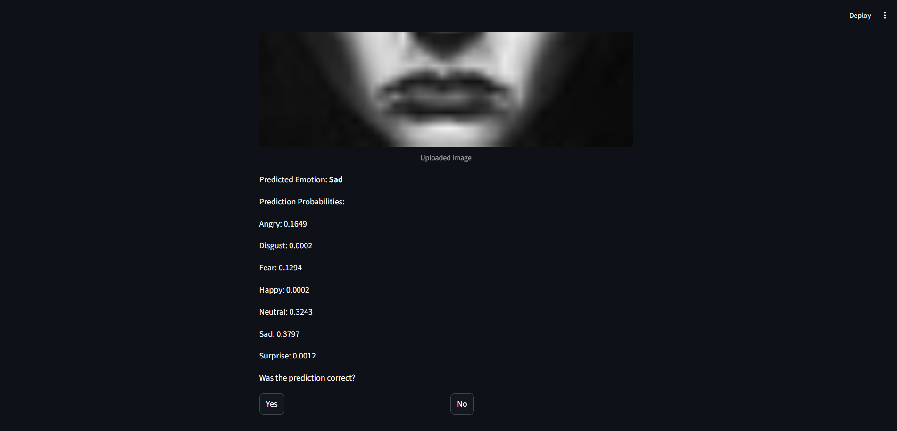

# Facial Emotion Recognition Using Deep Learning

This project, titled "A STUDY ON FACIAL EMOTION RECOGNITION USING DEEP LEARNING," is a Streamlit-based web application designed to recognize human emotions from static facial images. Leveraging deep learning techniques, the application aims to classify emotions such as happy, sad, angry, neutral, surprise, fear, and disgust.

## Project By
* **Pratik Sahu**

## Features
* **Image-based Emotion Detection:** Upload a static image containing a face to get an emotion prediction.
* **Deep Learning Model:** Utilizes a Convolutional Neural Network (CNN) built with TensorFlow/Keras for emotion classification.
* **Streamlit Web Interface:** Provides an intuitive and interactive user interface for easy interaction.
* **Seven Basic Emotions:** Capable of recognizing a range of emotions including happy, sad, angry, neutral, surprise, fear, and disgust.

## Demo/Screenshots (Highly Recommended!)
Include screenshots or a GIF of your Streamlit app in action. This is crucial for showcasing.
You can take screenshots of your local Streamlit app running and save them in a folder like `assets/` in your repository.


*A screenshot showing the main interface of the emotion recognition app.*


*A screenshot displaying an emotion prediction after an image upload.*

## How to Run Locally

### Prerequisites
Before you begin, ensure you have:
* **Python 3.9** (This project's virtual environment was set up with this version. Compatible with TensorFlow 2.x).
* **Git** installed on your system.

### Installation

1.  **Clone the repository:**
    Open your terminal or command prompt and run:
    ```bash
    git clone [https://github.com/YOUR_USERNAME/YOUR_REPO_NAME.git](https://github.com/YOUR_USERNAME/YOUR_REPO_NAME.git)
    cd YOUR_REPO_NAME
    ```

2.  **Create and activate a virtual environment:**
    It's crucial to create a virtual environment to manage project dependencies. We will use `py -3.9` to ensure compatibility with TensorFlow.
    ```bash
    py -3.9 -m venv img  # Creates a virtual environment named 'img' using Python 3.9

    # Activate the virtual environment
    .\img\Scripts\activate  # On Windows
    # source img/bin/activate # On macOS/Linux (if you were on a different OS)
    ```
    You should see `(img)` at the beginning of your terminal prompt, indicating the environment is active.

3.  **Install dependencies:**
    With your `img` environment active, install all required packages from `requirements.txt`:
    ```bash
    pip install -r requirements.txt
    ```

### Running the Application

Once all dependencies are installed, you can run the Streamlit application:
```bash
streamlit run app.py